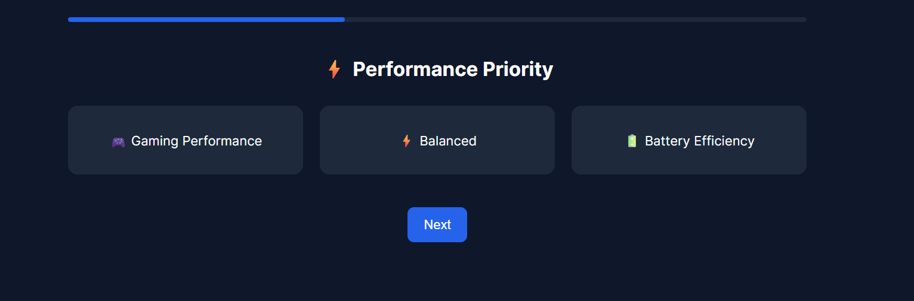
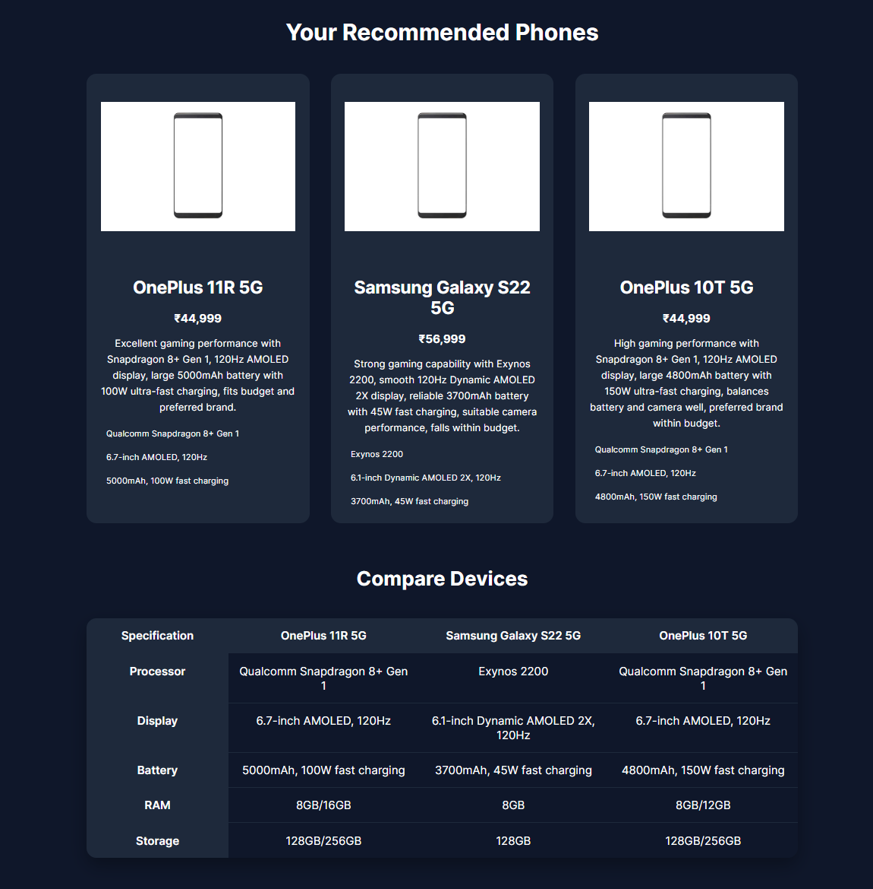
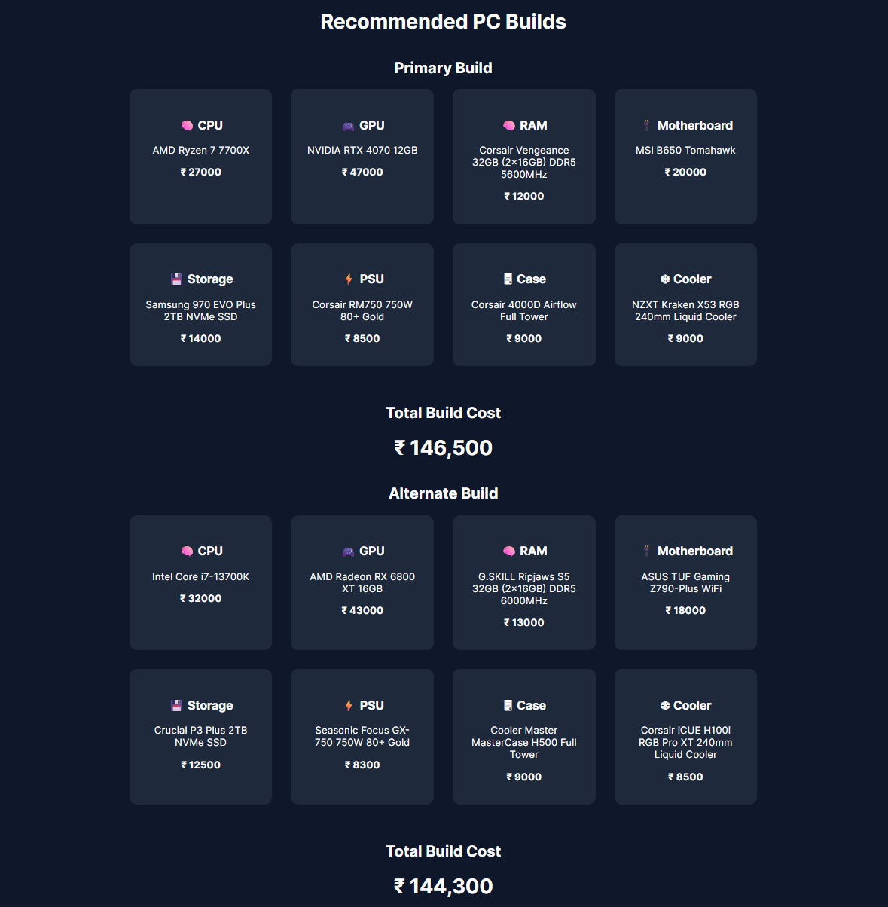

# 🤖 AI Device Advisor

AI Device Advisor is a web application that helps users choose the **best smartphone, laptop, tablet, or custom PC build** based on their requirements using AI-powered recommendations.

The application uses **OpenAI API with structured prompting** to analyze user preferences and generate optimized device recommendations.

---

## 🌐 Live Demo

🔗 **Live App:**
https://ai-device-advisor.onrender.com/

📦 **GitHub Repository:**
https://github.com/chinmaygawde7/ai-device-advisor

---

# ✨ Features

### 📱 Smartphone Advisor

* Interactive questionnaire
* Budget & usage based recommendations
* AI generated top 3 devices
* Device specification comparison table

---

### 🖥 PC Builder

Custom PC configuration generator that provides:

✔ Complete component list
✔ Primary optimized build
✔ Alternate build option
✔ Automatic total build cost calculation

Components include:

* CPU
* GPU
* Motherboard
* RAM
* Storage
* PSU
* Case
* Cooler

---

### 💻 Laptop Advisor

* Tailored laptop recommendations
* Usage-specific suggestions (gaming, work, student etc.)
* Hardware specification comparison

---

### 📟 Tablet Advisor

* Tablet recommendations based on:

  * media consumption
  * productivity
  * drawing
  * gaming

---

### 📊 Device Comparison

Recommended devices include a **clean specification comparison table** so users can easily evaluate options.

---

### 🎨 Modern UI

* Interactive tile based questionnaires
* Progress bar navigation
* Card-based results interface
* Responsive layout

---

# 🧠 How It Works

1. User selects the device category
2. The app collects user requirements through a guided questionnaire
3. Inputs are sent to the **OpenAI API**
4. AI generates structured JSON recommendations
5. Results are rendered into dynamic UI components

---

# 🛠 Tech Stack

### Backend

* Python
* Flask
* OpenAI API
* Gunicorn

### Frontend

* HTML
* CSS
* JavaScript

### Deployment

* Render (Free hosting)

---

# 📸 Screenshots

## Landing Page


---

## Questionnaire



---

## Device Recommendations



---

## PC Builder Results



---

# 🚀 Running Locally

Clone the repository

```bash
git clone https://github.com/yourusername/ai-device-advisor.git
cd ai-device-advisor
```

Install dependencies

```bash
pip install -r requirements.txt
```

Create environment variable

```bash
OPENAI_API_KEY=your_api_key
```

Run the application

```bash
python app.py
```

Open in browser:

```
http://localhost:5000
```

---

# 🔐 Environment Variables

The application requires the following environment variable:

```
OPENAI_API_KEY
```

Set this in your hosting platform or locally.

---

# 📁 Project Structure

```
ai-device-advisor
│
├── app.py
├── requirements.txt
│
├── templates
│   ├── index.html
│   ├── phone.html
│   ├── laptop.html
│   ├── tablet.html
│   ├── pc_build.html
│   └── result pages
│
├── static
│   ├── css
│   ├── javascript
│   └── images
│
└── README.md
```

---

# 📈 Future Improvements

Possible enhancements:

* Real-time device price APIs
* Performance score for device recommendations
* More advanced PC compatibility checks
* User preference saving

---

# 👨‍💻 Author

**Chinmay Gawde**

Cloud Engineer | AI Enthusiast | Infrastructure & Automation

---

# ⭐ Support

If you found this project useful, consider giving it a **star ⭐ on GitHub**.
